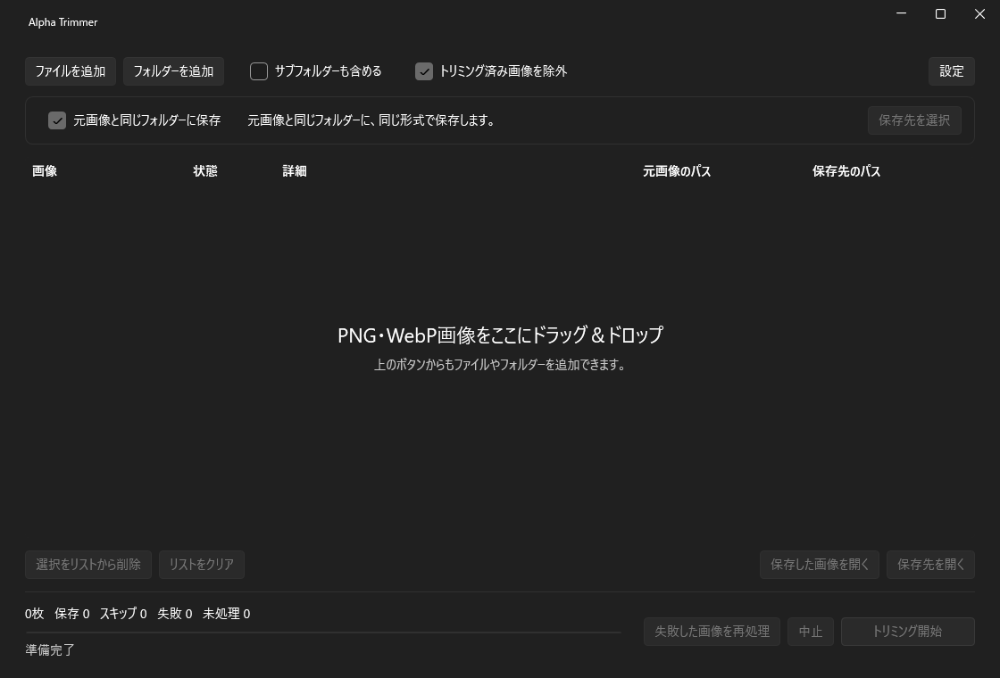

# Alpha Trimmer

[English](README.md)

PNG・WebP画像の透明な余白を切り取るWindows用ツールです。右クリックとGUIの両方で、複数の画像をまとめて処理できます。

> いちいちフォトショを開くのが面倒だったので作りました。
Photoshopの `透明ピクセルでトリミング` をワンクリックで行えるフリーソフトです。

| 動作環境 | 対応形式 |
| --- | --- |
| Windows 11 x64 | PNG・WebPの静止画 |

## インストール

[リリースページ](https://github.com/sino87/Alpha-Trimmer/releases)からインストーラーをダウンロードして実行します。

## 使い方

### 右クリック

画像を選択し、右クリック → `その他のオプションを確認` → `透明ピクセルをトリミング` を選びます。

https://github.com/user-attachments/assets/b457c35c-4ac3-4aa6-8302-d5883ee0f63a

### GUI

1. Alpha Trimmerを開きます。
2. ファイルやフォルダーを追加し `トリミング開始` を押します。ドラッグ＆ドロップでも追加できます。

保存先の変更、サブフォルダーの検索、失敗した画像の再処理にも対応しています。 `設定` では日本語・英語とライト・ダークを切り替えられます。

## ライセンス

[MIT](LICENSE) · [使用ライブラリ](THIRD-PARTY-NOTICES.md)

[変更履歴](CHANGELOG.ja.md) · [開発ガイド](docs/DEVELOPMENT.ja.md)
