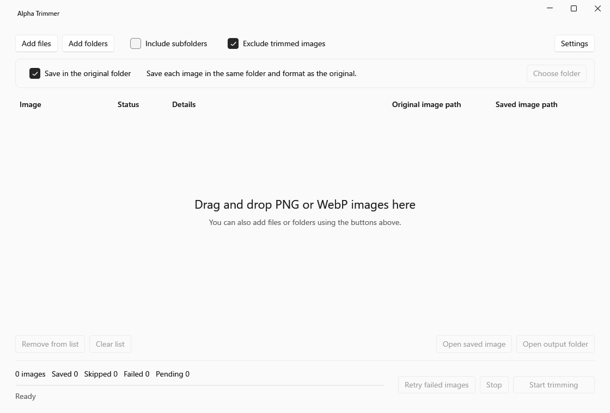

# Alpha Trimmer

[日本語](README.ja.md)

A Windows tool for trimming transparent margins from PNG and WebP images. Process multiple images at once using the `Context Menu` or `GUI`.

> I made this because opening Photoshop every time was a hassle.
This free tool lets you use Photoshop's `Trim Transparent Pixels` feature with one click.

| System | Supported formats |
| --- | --- |
| Windows 11 x64 | Static PNG and WebP |

## Installation

Download and run the installer from [Releases](https://github.com/sino87/Alpha-Trimmer/releases).

## Usage

### Context menu

Select images, then right-click > `Show more options` > `Trim Transparent Pixels`.

https://github.com/user-attachments/assets/b457c35c-4ac3-4aa6-8302-d5883ee0f63a

### GUI

1. Open Alpha Trimmer.
2. Add files or folders, then click `Start trimming`. Drag and drop is also supported.

You can change the output folder, include subfolders, and retry failed images. `Settings` lets you switch between Japanese and English, and light and dark themes.

## License

[MIT](LICENSE) · [Third-party notices](THIRD-PARTY-NOTICES.md)

[Changelog](CHANGELOG.md) · [Development guide](docs/DEVELOPMENT.md)
